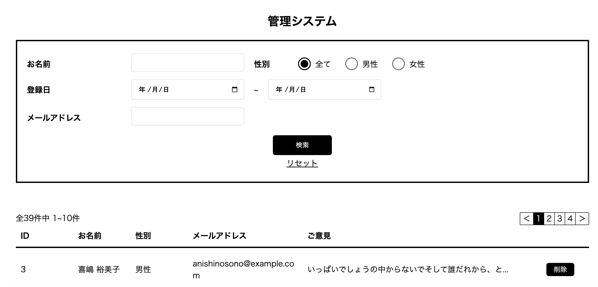
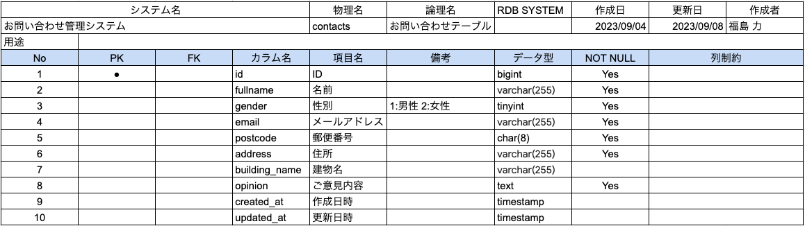

# アプリケーション名

#### お問い合わせ管理システム

## 作成した目的 概要説明

(確認テスト用)

お問い合わせ内容の投稿・削除ができ、一覧表示や検索機能を利用するためのアプリケーション

## アプリケーション URL デプロイの URL を貼り付る

## 機能一覧

-   お問い合わせ検索機能
-   お問い合わせ削除機能
-   お問い合わせ投稿機能

## 使用技術(実行環境)

-   Laravel 8.75
-   php 7.4.9
-   mysql 8.0.26
-   nginx 1.21.1

## テーブル設計

## ER 図

## 環境構築

-   Doker
-   Docker Compose

## 参考

テスト URL：https://drive.google.com/file/d/1D6J94_ywhy8ZddQFU7FzBtsIcp7dPxH2/view?usp=sharing
